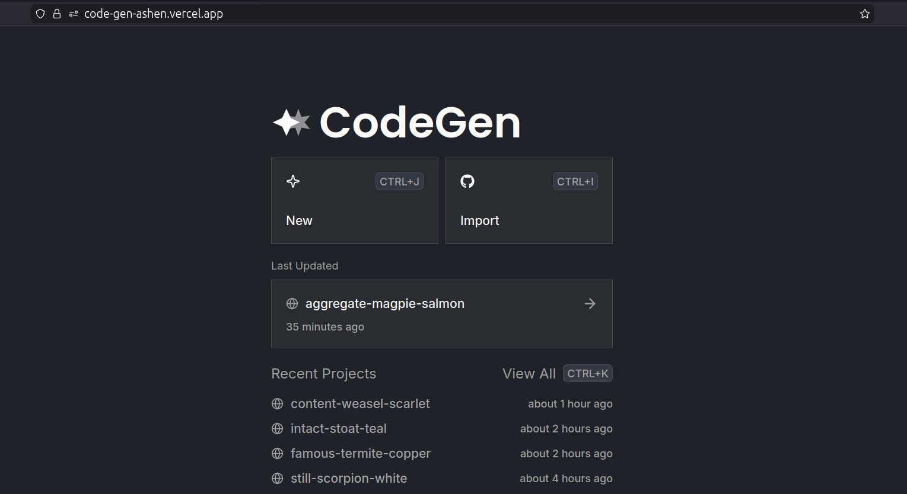
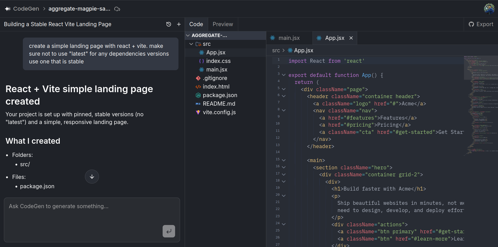
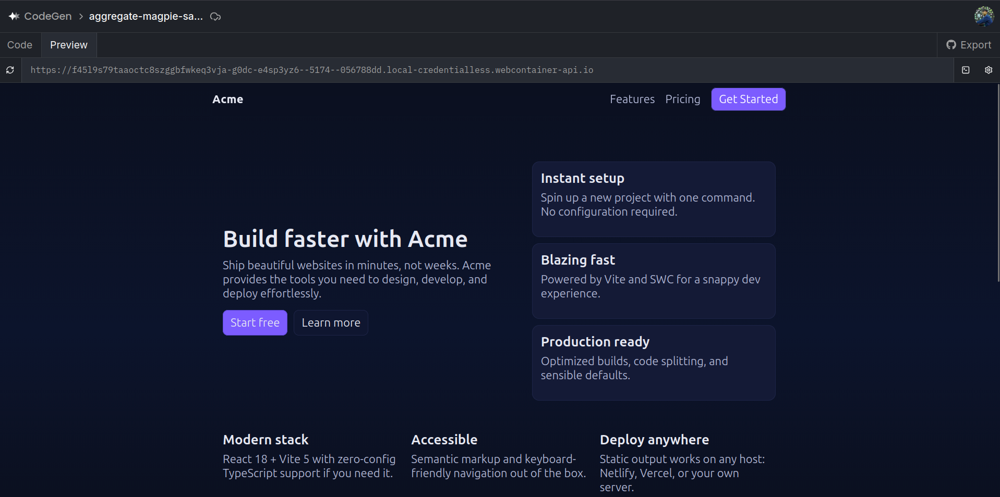

# CodeGen — AI-Powered Browser IDE

> Build, edit, and ship code projects with an AI agent that understands your entire codebase.

[](https://nextjs.org/)
[](https://react.dev/)
[](https://www.typescriptlang.org/)
[](https://tailwindcss.com/)
[](https://convex.dev/)
[](https://clerk.dev/)
[](https://www.inngest.com/)



---

## What is CodeGen?

CodeGen is a full-stack, AI-driven IDE that runs entirely in the browser. You describe what you want to build, and the AI agent writes the code, creates the files, and organizes the project structure. You can review and edit every file directly in the built-in code editor, run the project live via WebContainer, and push it to GitHub — all without leaving the browser.

It is inspired by tools like Cursor and Bolt, combining a production-quality code editor with a conversational AI agent that has direct access to your project's filesystem.

---

## Features

### AI Coding Agent
- Chat with an AI agent that can read, create, update, delete, and rename files in your project
- The agent understands your full project context and follows framework conventions (Next.js, FastAPI, etc.)
- Conversations are persisted per project with automatic title generation
- Cancel in-flight AI responses at any time
- Powered by any AI provider — OpenAI, Anthropic, or Google Gemini — via Vercel AI SDK and Inngest Agent Kit

<!-- img here -->
<!-- Screenshot of the AI chat panel mid-conversation, showing the assistant generating a multi-file Next.js component with tool calls visible (e.g., "Creating file: src/components/Button.tsx"). -->

### Code Editor
- Full-featured editor built on **CodeMirror 6**
- Syntax highlighting for Python, JavaScript/TypeScript, Java, C++, CSS, HTML, JSON, and Markdown
- **AI inline suggestions** — context-aware completions powered by GPT-4o-mini, triggered automatically as you type
- Minimap for large files
- Indentation markers
- Quick-edit shortcut for rapid in-place changes
- 1.5 s auto-save debounce syncing edits to the database in real time



### In-Browser Code Execution
- Run Node.js/JavaScript projects directly in the browser using **WebContainer API**
- Built-in terminal powered by **xterm.js**
- Customizable install and dev commands per project
- Real-time output streaming from the running process
- Persistent WebContainer instance per session for fast restarts



### GitHub Integration *(Pro)*
- **Import**: Clone any GitHub repository into CodeGen — folder structure, text files, and binary assets are all preserved
- **Export**: Push your project to a new GitHub repository with a custom name, visibility, and description
- Background job processing via **Inngest** with real-time status updates and cancellation support
- Requires GitHub OAuth connection through Clerk

<!-- img here -->
<!-- Screenshot of the GitHub import modal with a repo URL input field and an in-progress import status bar, alongside the GitHub export dialog with fields for repo name, description, and public/private toggle. -->

### Project & File Management
- Create multiple independent projects
- Hierarchical file tree with folders and files
- File browser with expand/collapse navigation
- Keyboard shortcuts:
  - `Cmd/Ctrl + K` — Command palette
  - `Cmd/Ctrl + J` — New project
  - `Cmd/Ctrl + I` — Import from GitHub

---

## Tech Stack

| Layer | Technology |
|---|---|
| Framework | Next.js 16 (App Router) + React 19 |
| Language | TypeScript 5 |
| Styling | Tailwind CSS 4 |
| UI Components | Radix UI, Base UI |
| Code Editor | CodeMirror 6 |
| State Management | Zustand |
| Database | Convex (serverless, real-time) |
| Auth | Clerk (with GitHub OAuth) |
| Background Jobs | Inngest + Inngest Agent Kit |
| AI Models | OpenAI GPT-4o / GPT-5 / GPT-5-mini, Google Gemini 2.5 Flash |
| AI Orchestration | Vercel AI SDK |
| In-Browser Runtime | WebContainer API |
| Terminal | xterm.js |
| Web Scraping | Firecrawl |
| Error Tracking | Sentry |
| GitHub API | Octokit |

---

## Architecture

```
codegen/
├── src/
│   ├── app/
│   │   ├── api/
│   │   │   ├── messages/          # Chat message endpoints + cancel
│   │   │   ├── suggestion/        # AI inline code suggestions
│   │   │   ├── quick-edit/        # Quick-edit API
│   │   │   ├── github/import/     # GitHub repo import
│   │   │   ├── github/export/     # GitHub repo export
│   │   │   ├── projects/          # Project creation from prompts
│   │   │   └── inngest/           # Inngest webhook handler
│   │   └── projects/[projectId]/  # Project workspace route
│   ├── features/
│   │   ├── conversations/         # AI chat UI + Inngest agent functions + file tools
│   │   ├── editor/                # CodeMirror editor + extensions + suggestions
│   │   ├── projects/              # Project list, file tree, GitHub workflows
│   │   └── preview/               # WebContainer integration + terminal
│   ├── components/ui/             # 50+ reusable UI components
│   └── lib/                       # Convex client, Firecrawl, utilities
└── convex/
    ├── schema.ts                  # Database schema (projects, files, conversations, messages)
    ├── projects.ts                # Project CRUD
    ├── files.ts                   # File CRUD
    ├── conversations.ts           # Conversation management
    └── system.ts                  # Internal mutations used by the AI agent
```

---

## Database Schema

**Projects** — `name`, `ownerId`, `importStatus`, `exportStatus`, `exportRepoUrls`, `settings` (install/dev commands)

**Files** — `projectId`, `parentId`, `name`, `type` (file | folder), `content`, `storageId` (binary)

**Conversations** — `projectId`, `title`

**Messages** — `conversationId`, `projectId`, `role` (user | assistant), `content`, `status` (processing | completed | cancelled)

---

## Getting Started

### Prerequisites

- Node.js 18+
- A [Convex](https://convex.dev) account
- A [Clerk](https://clerk.dev) account
- An AI provider API key — [OpenAI](https://platform.openai.com), [Anthropic](https://console.anthropic.com), or [Google Gemini](https://aistudio.google.com)
- An [Inngest](https://www.inngest.com) account
- *(Optional)* [Firecrawl](https://firecrawl.dev) API key for URL scraping

### 1. Clone and install

```bash
git clone <repo-url>
cd codegen
npm install
```

### 2. Configure environment variables

Create `.env.local` in the project root:

```env
# Clerk
NEXT_PUBLIC_CLERK_PUBLISHABLE_KEY=
CLERK_SECRET_KEY=

# Convex
NEXT_PUBLIC_CONVEX_URL=
CODEGEN_CONVEX_INTERNAL_KEY=

# AI Provider — set whichever you use (OpenAI, Anthropic, or Google Gemini)
OPENAI_API_KEY=
ANTHROPIC_API_KEY=
GOOGLE_GENERATIVE_AI_API_KEY=

# Inngest
INNGEST_EVENT_KEY=
INNGEST_SIGNING_KEY=

# Firecrawl (optional)
FIRECRAWL_API_KEY=

# Sentry (optional)
SENTRY_AUTH_TOKEN=
```

### 3. Set up Convex

```bash
npx convex dev
```

### 5. Set up Inngest

```bash
npx --ignore-scripts=false inngest-cli@latest dev
```

### 6. Run the development server

```bash
npm run dev
```

Open [http://localhost:3000](http://localhost:3000).

---

## How It Works

1. **Create a project** — name it and optionally describe it; the AI agent can scaffold the initial file structure for you.
2. **Chat with the agent** — describe features, bugs, or changes in natural language. The agent reads your files, makes edits, and reports what it did.
3. **Edit directly** — open any file in the editor. AI suggestions appear inline as you type.
4. **Run your project** — click the preview panel to spin up a WebContainer instance and see your app live.
5. **Export to GitHub** — when ready, export the entire project to a new GitHub repo in one click.

---

## Deployment

The recommended deployment target is **Vercel**:

```bash
vercel deploy
```

Make sure to set all environment variables in your Vercel project settings. The `next.config.ts` is already configured with the required `Cross-Origin-Embedder-Policy` and `Cross-Origin-Opener-Policy` headers needed for WebContainer to work in production.
